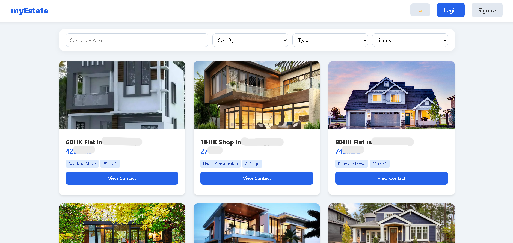

# 🏠 myEstate - Modern Real Estate Marketplace

myEstate is a full-stack MERN (MongoDB, Express, React, Node.js) application designed for seamless property buying and selling. It features an aesthetic blue-white theme, dark mode support, and a unified user experience where any registered user can post their own properties or browse listings from others.



---

## ✨ Features

- **Unified User Accounts**: No separate roles! Sign up to both post your own properties and contact other sellers.
- **Advanced Filtering & Search**: Filter by property type, rooms, status (Ready/Construction), and category.
- **Smart Sorting**: Sort properties by price (Highest to Lowest and vice versa).
- **Dynamic Themes**: Fully responsive UI with a beautiful **Light/Dark Mode** toggle.
- **Secure Authentication**: JWT-based login and signup with encrypted passwords using Bcrypt.
- **CRUD Operations**: Users can Create, Read, Update (Edit), and Delete their own property listings.
- **Protected Contact Info**: Seller contact details are only visible to logged-in users to prevent spam.

---

## 🛠️ Tech Stack

**Frontend:**
- **React.js** (Vite)
- **Vanilla CSS** (No libraries, custom aesthetic styling)
- **React Context API** (State management for Auth)
- **Axios** (API requests)

**Backend:**
- **Node.js & Express**
- **MongoDB & Mongoose** (Database & Schema Modeling)
- **JSON Web Tokens (JWT)** (Authentication)
- **Bcrypt.js** (Password Hashing)


---

## 🚀 Getting Started

### 1. Clone the repository
```bash
git clone [https://github.com/your-username/myEstate.git](https://github.com/your-username/myEstate.git)
cd myEstate
```

### 2. Setup the Backend
```bash
cd server
npm install
node index.js
```

### 3. Setup the Frontend
```bash

cd client
npm install
npm run dev
```